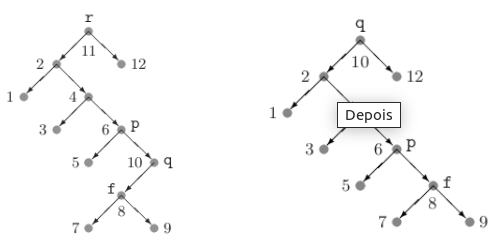

# Busca

## Busca binária em vetores ordenados

### Paradigma da divisão e conquista

A ideia é dividir o vetor no meio, procuramos o elemento da esquerda caso o elemento seja menor que o elemento central, ou procurar na direita caso seja maior. Repetimos, recursivamente, até o elemento procurado ser o elemento central (ou não, caso haja uma falha na busca).

~~~C
#define key(A) (A.chave)

typedef int Key;
typedef struct data Item;
struct data
{
    Key chave;
    char info[100];
};

Item binary_search(Item *v, int I, int r, Key k)
{
    if(l >= r)
        return NULL;

    int m = (l + r) / 2;

    if(k == key(v[m]))
        return v[m];
    
    if(k < key(v[m]))
        return binary_search(v, l, m-1, k);

    return binary_search(v, m+1, r, k);
}
~~~

Complexidade até $\lfloor \lg(n) \rfloor + 1$ comparações (acerto ou falha).

### Interpolation search

Mais próximo do início ou fim do vetor

$l + (r - l) \times (1/2)$

- 1/2: posição do elemento do meio
- (k - inicio) / (fim - inicio) (proporção dos k elementos iniciais em relação ao total)

$l + (r - l) \times (k - key(v[l]) / key(v[r]) - key(v[l]))$

~~~C
Item binary_search(Item *v, int I, int r, Key k)
{
    if(l >= r)
        return NULL;

    int m = l + (r - l) * ((k - key(v[l])) / (key(v[r]) - (key(v[l]))));

    if (k == key(v[m]))
        return v[m];
    
    if (k < key(v[m]))
        return binary_search(v, l, m-1, k);

    return binary_search(v, m + 1, r, k);
}
~~~

Esse algoritmo é interessante para muitas chaves, mas é altamente dependente da boa distribuição das chaves, caso os dados numéricos deem um salto muito grande (de 21 para 90), o algoritmo acaba por interpretar de forma incorreta, levando a um maior tempo de execução.

## Árvore binária de busca

Árvores binárias combinam a flexibilidade da inserção nas listas encadeadas com a eficiência da busca nos vetores ordenados.

Todo nó interno tem dois ponteiros que apontam para filho à esquerda e à direita, com nós folha apontando para NULL.

O conteúdo dos nós é chamado de chave, e em sua estrutura, cada nó tem chave maior do que a chave da subárvore à esquerda, e tem chaves maiores do que as chaves da subárvore à direita. Essa estrutura permite a busca binária de um nó a partir da raiz.

~~~C
#define info(A) (A.info)
#define key(A) (A.chave)
#define less(A, B) ((A) < (B))
#define eq(A, B) ((A) == (B))
#define exch(A, B) {Item t = A; A = B; B = t}
#define compexch(A, B) if(less(B, A)) exch(A, B)

typedef int Key;
typedef struct data Item;
struct data
{
    Key chave;
    char info[100];
};

typedef struct node STnode;
struct node
{
    Item item;
    STnode *esq;
    STnode *dir;
};

STnode *new(Item x, STnode *e, STnode *d)
{
    STnode *no = malloc(sizeof(STnode));

    no->esq = e;
    no->dir = d;
    no->item = x;

    return no;
}
~~~

### Busca

Como sua estrutura divide entre maiores e menores, a busca binária acontece a partir de sua raiz. Caso o item procurado seja menor que a raiz, procure na sub-árvore esquerda. Caso contrário, procure na sub-árvore da direita.

~~~C
STnode *STsearch(STnode *no, Key v)
{
    if(no == NULL || eq(v, key(no->item)))
        return no;
    
    if(less(v, key(no->item)))
        return STsearch(no->esq, v);
    
    else
        return STsearch(no->dir, v);
}
~~~

### Inserção

Para a inserção, as propriedades da árvore binária de busca devem ser mantidas, com elementos menores para esquerda, e elementos maiores para direita.

~~~C
STnode *STinsert(STnode *no, Item item)
{
    if(no == NULL)
        return new(item, NULL, NULL);

    Key novo = key(item);
    Key atual = key(no->item);

    if(less(novo, atual))
        no->esq = STinsert(no->esq, item);

    else
        no->dir = STinsert(no->dir, item);
    
    return no;
}
~~~

### Remoção

Para remover um item, temos que tomar alguns cuidados, devemos definir algumas regras. Se um nó tiver filho único, este filho assume sua posição, caso o nó tenha dois filhos, outro nó "adota" seus filhos e assume sua posição.

Garantimos que o novo nó seja menor que todos os elementos à direita do removido, fazendo com que o nó seja o menor dos maiores, ou sendo o menor dos itens da sub-árvore direita. Sendo o mesmo valido para a subárvore direita, sendo o maior dos menores e o maior dos itens da sub-árvore esquerda.

Sendo o nó reposicionado o menor dos maiores, ou o maior dos menores, garante-se as propriedades pois os elementos das sub-árvores esquerda são menores que os da direita.

~~~C
//remove o primeiro nó com a chave "remove"
STnode *STdelete(STnode *no, Key remove)
{
    //não achou
    if(no == NULL)
        return NULL
    
    Key atual = key(no->item);

    //procure à esquerda
    if(less(remove, atual))
        no->esq = STdelete(no->esq, remove);
    
    //procure à direita 
    else if (less(atual, remove))
        no->dir = STdelete(no->dir, remove);

    //achou
    else
    {
        if(no->dir == NULL)
        {
            //filho único: retorne o filho a esquerda para rearranjar a árvore  
            STnode *aux = no->esq;
            free(no);
            return aux;
        }

        if(no->esq == NULL)
        {
            //filho único: retorne o filho a esquerda para rearranjar a árvore  
            STnode *aux = no->dir;
            free(no);
            return aux;
        }

        //Se tiver os dois filhos, achar um substituto
        STnode *aux = no;

        //menor dos maiores
        no = min(aux->dir);

        //remova o substituto e ele assume o filho direito
        no->dir = deleteMin(aux->dir);

        //substituto assume filho esquerdo
        no->esq = aux->esq;

        //libera memória do removido
        free(aux);
    }

    return no;
}

//menor = elemento mais a esquerda
STnode *min(STnode *no)
{
    if(no->esq == NULL)
        return no;
    
    return min(no->esq);
}

//"removendo" o menor elemento a partir de um nó
STnode *deleteMin(STnode *no)
{
    //achando o menor, devolva o filho da direita para atualizar a esquerda do pai do menor 
    if(no->esq == NULL)
        return no->dir;
    
    no->esq = deleteMin(no->esq);
    return no;
}

~~~

### Performance

A performance da árvore binária de busca depende do balanceamento da árvore, sendo no melhor caso, tendo performance N e no melhor caso lg(n). Em árvores não balanceadas, o comportamento do algoritmo se assemelha mais ao caso médio lg(n), sendo o primeiro elemento a raiz, com chaves inseridas aleatoriamente. Contudo árvores completamente balanceadas, e completamente desbalanceadas são casos raros.