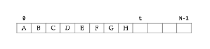

# Pilhas

## O QUE É

Uma pilha é uma estutura de dados que admite remoção de elementos e inserção de novos objetos. Mais especificamente, uma pilha (stack) é uma estrutura sujeita à seguinte regra de operação:

<i>Sempre que houver uma remoção, o elemento removido é o que está na estrutura a <b>MENOS</b> tempo.</i>

Em outras palavras, o primeiro objeto a ser inserido na pilha é o último a ser removido. Essa política é conhecida pela sigla LIFO (***L**ast **I**n **F**irst **O**ut)*.

## Implementação em vetor

Suponha que nossa pilha esteja armazenada em um vetor pilha[0...N-1], onde a parte ocupada pela pilha é:

 pilha[0...t-1] 

O índice t indica a primeira posição vaga do vetor, e t-1 é o índice to topo da pilha. A pilha está *vazia* se t == 0, e *cheia* se t vale N. 

Para remover, ou tirar um elemento da pilha, operação conhecida como desempilhar (*pop*) diminuimos o valor de "*t*".

~~~C
x = pilha[--t];
~~~

Para desempilhar, é importante se certificar de que a pilha não está vazia.

Para inserção de elementos na pilha (nesse caso um objeto y), operação conhecida como empilhar (*push*), atribuimos o valor seguinte a "*t*" como "*y*".

~~~C
pilha[t++] = y;
~~~

Mais uma vez, é necessário nos atentarmos à codição atual da pilha. Nesse caso, é preciso certificar que a pilha não está cheia, de modo a evitar um transbordamento (*overflow*).

~~~C
char desempilha()
{
    return pilha[--t];
}

void empilha(char y)
{
    pilha[t++] = y;
}
~~~