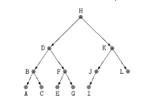

# Árvores Binárias

## O QUE SÃO

Árvores binárias são um TAD mais geral que listas encadeadas. É um conjunto de registros que satisfaz certas condições (nem sempre explicitas, mas definidas pelo contexto). Os registros são chamados de nós (ou células). Cada nó tem um endereço. Suporemos, por enquanto, que cada nó tem apenas 3 campos, um número inteiro e dois ponteiros para nós. Assim, podemos definir nós da seguinte forma:

~~~C
typedef struct no
{
    int conteudo;
    no *esquerda;
    no *direita;
} no;
~~~

O campo conteúdo é a carga útil do nó, sendo os outros campos apenas para dar estrutura à árvore. O campo *esquerda* de cada nó contém *NULL* ou o endereço de outro nó. O mesmo vale para o nó *direita*.

Se o campo *esquerda* de algum nó for outro nó, chamamos o segundo nó de ***nó filho esquerdo***, sendo o mesmo válido para o campo *direita*. Quando um nó *F* é filho (esquerdo ou direito) de *P*, dizemos que *P* é o pai de *F*. Finalmente, quando um nó não tem filhos, ele é chamado de ***Nó folha*** (leaf).

## Árvores e subárvores

Suponha que x é um nó. Um descendente de x é qualquer nó que possa ser alcançado pela iteração das instruções a seguir em qualquer ordem (enquanto qualquer uma das iterações for diferente de NULL):

~~~C 
x = x->esquerda;

// e

x = x->direita;
~~~

Um nó x, juntamente com todos os seus descendentes é uma árvore binária. Dizemos que x é a ***raiz*** (root) da árvore. Se x tiver um pai, essa árvore é subárvore de alguma árvore maior. Se x é NULL, a árvore é vazia.

Para qualquer nó x, o nó da esquerda é a raiz da ***subárvore esquerda***, sendo o mesmo válido para a árvore da direita.

## Endereço de uma árvore e definição recursiva

O *endereço* de uma árvore binária é o endereço de sua raiz. É conveniente confundir verbalmente, árvores com seus endereços. A frase "cosidere a árvore r", na verdade significa "considere a árvore cuja raiz tem o endereço r". Essa convenção sugere a introdução do nome alternativo "***arvore*** para o tipo de dados "ponteiro-para-no". Dada essa convenção, podemos dar uma definição recursiva de árvore binária, um ponteiro para nó "***r***" é uma árvore binária se:

1- ***r*** é NULL

ou

2- ***r->esquerda*** e ***r->direita*** são árvores binárias.

### Varredura esquerda-raiz-direita (***inorder traversal***)

Uma árvore binária pode ser percorrida de muitas maneiras diferentes. Uma maneira particularmente importante é a esquerda-raiz-direita, ou e-r-d, também conhecida como *inorder traversal*, ou varredura infixa, ou varredura central. Esse método consiste em visitar:

1- a subárvore esquerda da raiz, em ordem e-r-d, 
2- a raiz, 
3- a subárvore direita da raiz, em orderm e-r-d.

Nessa ordem. A imagem a seguir denota a ordem na qual são visitados os nós da árvore numa varredura e-r-d.

No código abaixo, temos uma função recursiva que faz a varredura e-r-d de uma árvore binária:

~~~C
void erd(arvore r)
{
    if (r != NULL)
    {
        erd (r->esquerda);

        printf("%d\n", r->conteudo);

        erd(r->direita);
    }
}
~~~

## Altura e profundidade 

### Altura

A ***altura de um nó*** x em uma árvore binária, é a distância entre x e o seu descendente mais distante. Mais precisamente, a ***altura de um nó*** é o número de passos no mais longo caminho que leva de x até uma folha. Os caminhos a que essa definição se refere são os obtidos pela iteração das instruções:

~~~C 
x = x->esquerda;

// e

x = x->direita;
~~~

em qualquer ordem. A ***altura de uma árvore*** (height) é a altura da raiz da árvore. Uma árvore com apenas um nó tem altura 0. 

A árvore da figura acima tem altura 3.

Podemos calcular a altura de uma árvore usando a função a seguir:

~~~C
int altura(arvore r)
{
    if (r == NULL)
        return -1;

    else
    {
        int h_esquerda = altura (r->esquerda);
        int h_direita = altura (r->direita);

        if (h_esquerda < h_direita)
            return h_direita + 1;
        else
            return h_esquerda + 1;
    }
}
~~~

A relação entre a altura e o número de nós de uma árvore binária é como descrito abaixo:

$$\lg(n) \leqslant h \leqslant n-1$$

onde lg(n) denota $\lfloor \log(n) \rfloor$, ou seja, o piso de log(n). Uma árvore binária de altura n-1 é um "tronco sem galhos": cada nó tem no máximo um filho. No outro extremo, uma árvore de altura lg(n) é "quase completa", todos os "níveis" estão lotados exceto talvez o último.

|   n   |  lg(n) |
|-------|-------|
|   4   |   2   |
|   5   |   2   |
|   6   |   2   |
|  10   |   3   |
|  64   |   6   |
|  100  |   6   |
|  128  |   7   |
| 1000  |   9   |
| 1024  |  10   |

Uma árvore binária é ***balanceada*** (ou ***equilibrada***) se, em cada um de seus nós, as subárvores esquerda e direita tiverem aproximadamente a mesma altura. Uma árvore binária balanceada com n nós tem altura próxima de log *n*. Sempre que possível, convém trabalhar com árvores que são balanceadas. Mas isso não é fácil se a árvore aumenta e diminui ao longo da execução do programa.

### Profundidade

A ***profundidade*** (depth) de um nó *s* em uma árvore binária com raiz r é a distância de r a s. Mais exatamente, a profundidade de s é o comprimento do único caminho que vai de r até s, por exemplo, a profundidade de r é 0 e a profundidade de r->esquerda é 1.

## Nós com campo pai

Em algumas aplicações, é conveniente ter acesso direto ao pai de cada nó. Para isso, é preciso acrescentar um campo pai a cada nó:

~~~C
typedef struct no
{
    int conteudo;
    struct no *pai;
    struct no *esquerda, *direita;
} no;
~~~

Como a raiz da árvore não tem pai, é preciso tomar uma decisão de projeto a respeito do valor do campo pai nesse caso. Se r é a raiz da árvore, poderíamos dizer r->pai == NULL. Mas é melhor adotar a convenção:

~~~C
r->pai = r;
~~~

quando r é a raiz. É claro que r será o único nó da árvore a ter essa prioridade.

## Primeiro e último nós

Considere o seguinte problema sobre uma árvore binária: encontrar o primeiro nó da árvore na ordem e-r-d. É claro que o problema só faz sentido se a árvore não é vazia. A seguir:

~~~C
no *primeiro(arvore r)
{
    while(r->esquerda != NULL)
        r = r->esquerda;
    
    return r;
}
~~~

## Nó seguinte e anterior (sucessor e predecessor)

Digamos que x é um nó de uma árvore binária. O problema é calcular o nó seguinte na ordem e-r-d. Para tal é necessário que os nós tenham um campo pai. A função a seguir resolve o problema. É claro que a função só deve ser chamada com x diferente de NULL. A função devolve o nó seguinte a x ou devolve NULL se x é o último nó.

~~~C
no *seguinte(no *x)
{
    if(x->direita != NULL)
    {
        no *y = x->direita;
        
        while(y->esquerda != NULL)
            y = y->esquerda;

        return y;
    }
    
    while(x->pai != NULL && x->pai->direita == x)
        x = x->pai;
    
    return x->pai;
}
~~~

Na linha "A", y é o primeiro nó, na ordem e-r-d, da subárvore cuja raiz é x->direita. As linhas "B" fazem com que x suba na árvore enquanto for filho direito de alguém.